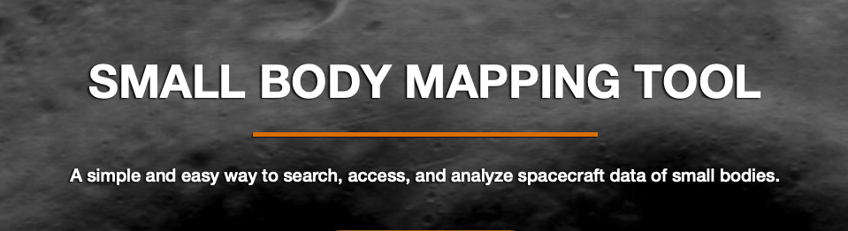
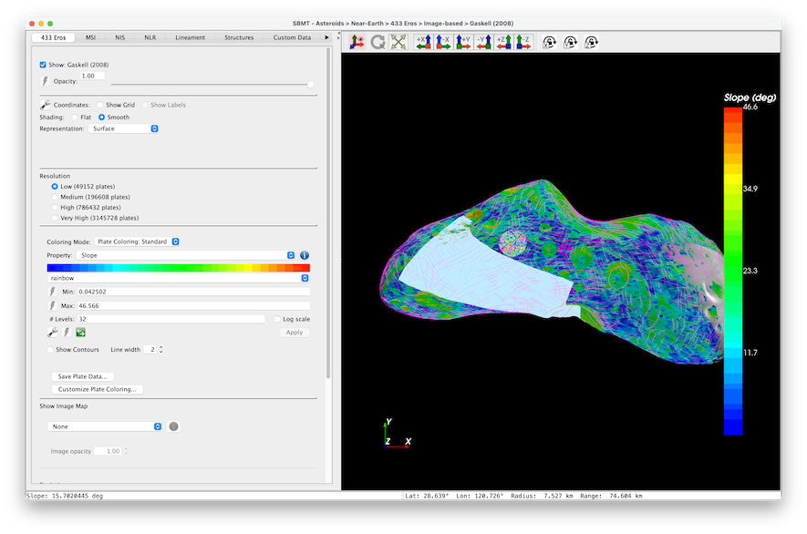

## Description

Spacecraft missions return massive amounts of valuable data, but those data can be hard to access, analyze, and interpret. Asteroids, comets, and small moons present additional challenges: the irregular shapes of these bodies are ill-suited for two-dimensional projections.
 
The Small Body Mapping Tool (SBMT) addresses these challenges. The SBMT is an interactive tool that allows users to visualize and manipulate small body shape models in three dimensions. The Tool enables quick and easy searches for spacecraft data of a variety of small bodies. Once selected, data can be projected directly onto the shape models, and built-in analysis and mapping capabilities facilitate scientific investigations.
 
The SBMT has been used by several flight mission teams, including Dawn, Rosetta, OSIRIS-REx, Hayabusa2, MMX, Lucy, and Dragonfly. Mission-specific shape models, data, and features will be available to all SBMT users once the mission data become publicly available.

## Referencing the Small Body Mapping Tool

Currently, the best reference to cite for the SBMT is [Ernst et al., 2018, The Small Body Mapping Tool (SBMT) for Accessing, Visualizing, and Analyzing Spacecraft Data in Three Dimensions, LPSC 49, abstract no. 1043](http://sbmt.jhuapl.edu/pubs/Ernst_LPSC2018_SBMT.pdf). Click [here](http://sbmt.jhuapl.edu/References.php) for a list of papers and abstracts that have described or used the SBMT.

This Github repository can also be reference via the DOI located on the right side of the project.

## Data Available in the Small Body Mapping Tool

There are many bodies available, see [the bodies page](bodies.md) for more information.

## The SBMT Libraries

The Small Body Mapping Tool is made up of a series of libraries, and are maintained in other repositories in this GitHub organization.

| Repo | Last Release | Last Commit | 
| ---- | ------------ | ----------- |
| [saavtk](https://github.com/NASA-Planetary-Science/saavtk) |  | | 
| [sbmt-core](https://github.com/NASA-Planetary-Science/sbmt-core) |  | | 
| [sbmt-layer](https://github.com/NASA-Planetary-Science/sbmt-layer) |  | | 
| [sbmt-pipeline](https://github.com/NASA-Planetary-Science/sbmt-pipeline) |  | | 
| [sbmt-pointing](https://github.com/NASA-Planetary-Science/sbmt-pointing) |  | | 
| [sbmt-config](https://github.com/NASA-Planetary-Science/sbmt-config) |  | | 
| [sbmt-query](https://github.com/NASA-Planetary-Science/sbmt-query) |  | | 
| [sbmt-util](https://github.com/NASA-Planetary-Science/sbmt-util) |  | | 
| [sbmt-image](https://github.com/NASA-Planetary-Science/sbmt-image) |  | | 
| [sbmt-spectrum](https://github.com/NASA-Planetary-Science/sbmt-spectrum) |  | | 
| [sbmt-dem](https://github.com/NASA-Planetary-Science/sbmt-dem) |  | | 
| [sbmt-lidar](https://github.com/NASA-Planetary-Science/sbmt-lidar) |  | | 
| [sbmt-stateHistory](https://github.com/NASA-Planetary-Science/sbmt-stateHistory) |  | | 
| [sbmt-model](https://github.com/NASA-Planetary-Science/sbmt-model) |  | | 
| [sbmt-client](https://github.com/NASA-Planetary-Science/sbmt-client) |  | | 


## Visuals

The SBMT allows users to visualize scientific data on irregularly shaped bodies in our solar system.  The image below shows data such as lineaments, structures, spectral footprints, images, LIDAR, and plate colorings on the body Eros, as captured with the NEAR spacecraft. 



## Installation

Once all libraries have been made available, build and installation directions will be posted here.

## Support
For help with any of the SBMT framework libraries, please file an issue under the appropriate project.  For help running SBMT, you can email [sbmt@jhuapl.edu](mailto:sbmt@jhuapl.edu)


## Contributing

We welcome pull requests on any of the SBMT projects.  However, due to funding constraints, there is no guarantee that pull requests will be merged with the main line code or even reviewed. We will do the best we can.

To contribute: fork, then clone the repo in question.  For example, for sbmt-core:

```
git clone git@github.com:your-username/sbmt-core.git
```

Make your changes, and push them to your fork.  Then submit a pull request.

Things that will help increase that your pull request is reviewed and accepted:

- Write tests (and make sure they pass!)
- Write a [good commit message](https://tbaggery.com/2008/04/19/a-note-about-git-commit-messages.html)

## Authors and acknowledgments

### Our special thanks go out to:

- Eli Kahn (original author at JHU/APL)

### Science Leads:

- Oliver Barnouin
- Carolyn Ernst
- Terik Daly

### Developers over the years at APL:
- Josh Steele (current technical lead)
- James Peachey
- Allison Glantzberg
- Norberto Lopez
- Mike Zimmerman
- Russell Taylor
- Lillian Nguyen
- Bridget Carr
- Colleen O'Shea
- Alex Welsh

Funding for the Small Body Mapping Tool has come from many sources over the years, including but not limited to:

- 2019 PDART (award number: 80NSSC20K1058)
- The OSIRIS-REx mission (NASA)
- The Lucy Mission (NASA)
- The DART Mission (NASA)
- The Rosetta Mission (ESA)
- The MMX Mission (via NASA/MEGANE)

## License

All SBMT projects are MIT licensed, and contain the following in their LICENSE.md files in each project:

Copyright 2024 Johns Hopkins University Applied Physics Laboratory, LLC

Permission is hereby granted, free of charge, to any person obtaining a copy of this software and associated documentation files (the “Software”), to deal in the Software without restriction, including without limitation the rights to use, copy, modify, merge, publish, distribute, sublicense, and/or sell copies of the Software, and to permit persons to whom the Software is furnished to do so, subject to the following conditions:

The above copyright notice and this permission notice shall be included in all copies or substantial portions of the Software.

THE SOFTWARE IS PROVIDED “AS IS”, WITHOUT WARRANTY OF ANY KIND, EXPRESS OR IMPLIED, INCLUDING BUT NOT LIMITED TO THE WARRANTIES OF MERCHANTABILITY, FITNESS FOR A PARTICULAR PURPOSE AND NONINFRINGEMENT. IN NO EVENT SHALL THE AUTHORS OR COPYRIGHT HOLDERS BE LIABLE FOR ANY CLAIM, DAMAGES OR OTHER LIABILITY, WHETHER IN AN ACTION OF CONTRACT, TORT OR OTHERWISE, ARISING FROM, OUT OF OR IN CONNECTION WITH THE SOFTWARE OR THE USE OR OTHER DEALINGS IN THE SOFTWARE.


